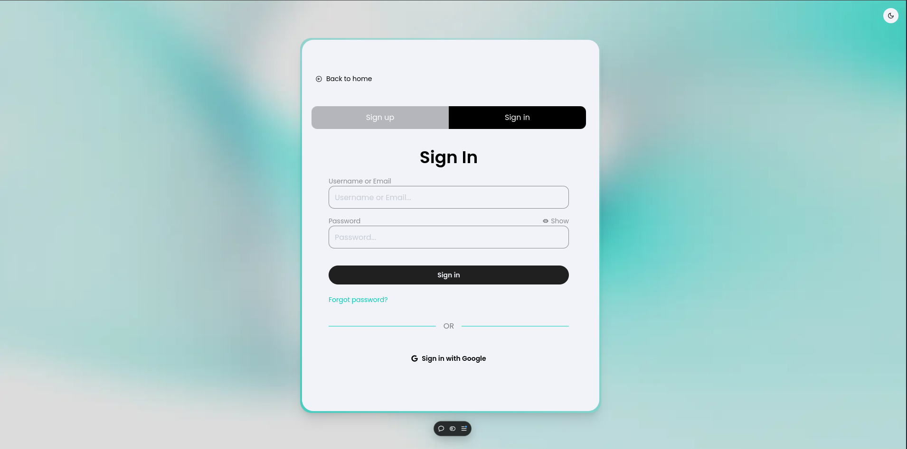
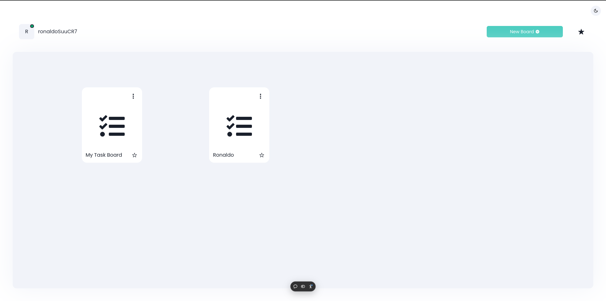
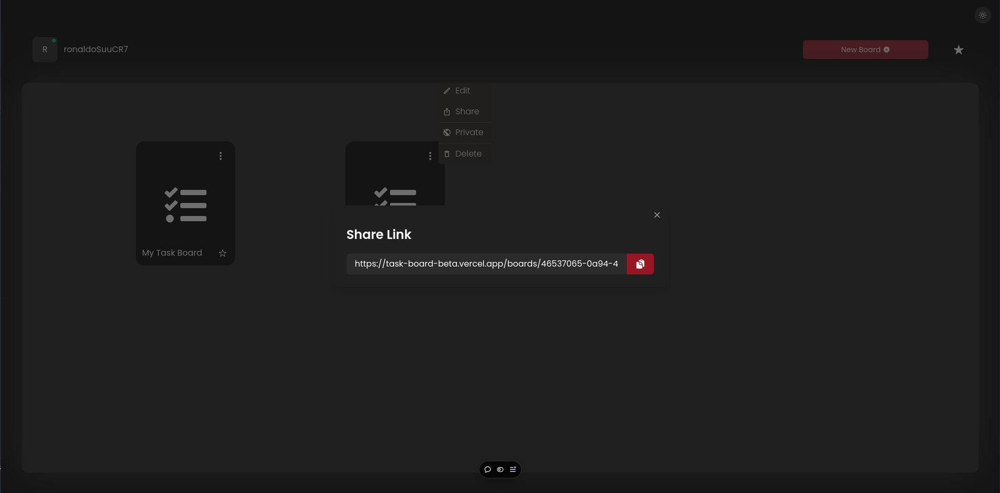
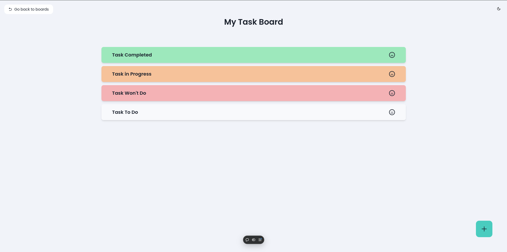
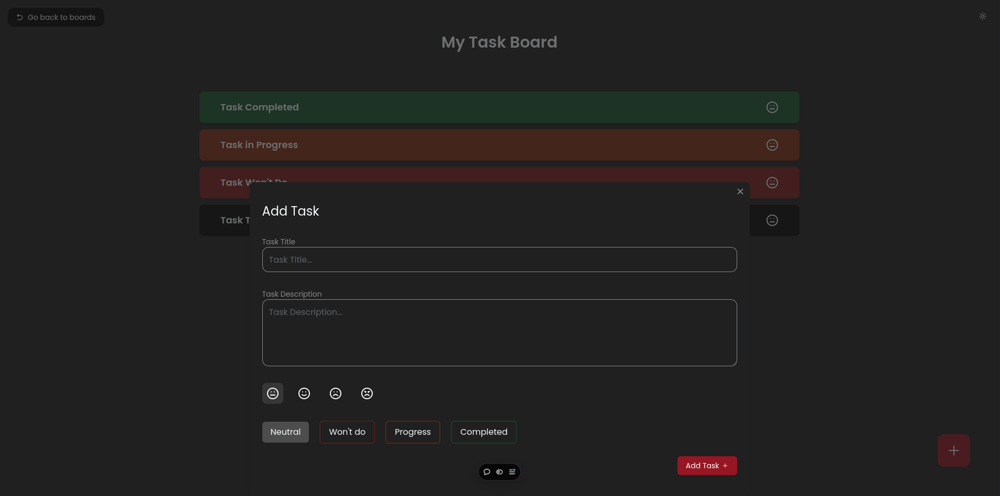

# Task Board Web App

A web application for managing tasks and projects with an intuitive interface, offering features like task assignment, progress tracking, and collaboration.

## Table of Contents

- [Introduction](#introduction)
- [Features](#features)
- [Demo](#Demo)
- [Usage](#usage)
- [Screenshots](#screenshots)
- [Technologies Used](#technologies-used)
- [Contributing](#contributing)
- [Contact](#contact)

## Introduction

This Task Board Management web app is designed to streamline project management. It helps users organize tasks, assign responsibilities, and track progress efficiently.

## Features

- Light and dark theme
- Project boards and task lists
- Board sharing and privacy
- Integration with third-party tools
- Customizable board views

## Demo

Check out the live demo of the project [here](https://task-board-beta.vercel.app).

## Usage

### Main Features

1. Log in to the application.
2. Create a new board.
3. Add tasks to the board.
4. Manage board Privacy.
5. Share the board with other users.
6. Customize the tasks icon and status.

## Screenshots

### 1. Home Page

This is a screenshot of the home page: (The UI is still under development)


### 2. Sign In Page

Below is a screenshot of the Sign In page:



### 2. Boards Page

This is a screenshot of the page where all boards are displayed and can be managed:



### 3. Sharing Board Link

You can share the board with other users by sending them the board link:



### 4. Tasks Page

This is a screenshot of the page where all tasks are displayed and can be managed:



### 5. Add Task

You can add a new tasks to the board or edit an existing one:



## Technologies Used

- **Frontend:** Next.js, React, TypeScript, Tailwind CSS
- **Backend:** Node.js, Express, MongoDB

## Contributing

### Fork the Repository

```bash
git clone https://github.com/Adel2411/Task-Board.git
```

## Make Changes

- Create a new branch for your feature or bugfix.
- Commit your changes with clear messages.

## Submit a Pull Request

- Push your branch to GitHub.
- Open a pull request for review.

## Contact

- Email:
  - hadjarabadel.2411@gmail.com
  - becharwalid9@gmail.com
- GitHub:
  - [Adel2411](https://github.com/Adel2411)
  - [edaywalid](https://github.com/edaywalid)
