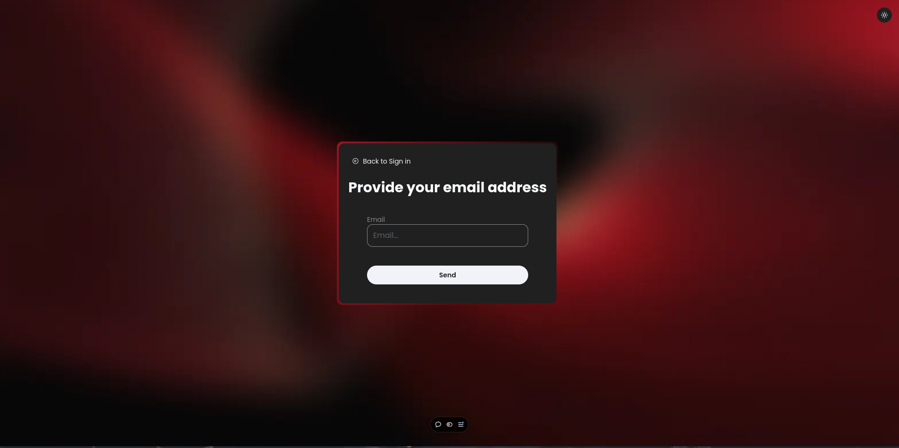

#  **Task Board Web App** 

A web application for managing tasks and projects with an intuitive interface, offering features like task assignment, progress tracking, and collaboration.

---

## 📚 Table of Contents

- [✨ Introduction](#introduction)
- [🌟 Features](#features)
- [🚀 Demo](#demo)
- [⚙️ Usage](#usage)
- [📸 Screenshots](#screenshots)
- [🛠️ Technologies Used](#technologies-used)
- [🤝 Contributing](#contributing)
- [📬 Contact](#contact)

---

## ✨ Introduction

This **Task Board Management** web app is designed to streamline project management. It helps users organize tasks, assign responsibilities, and track progress efficiently.

---

## 🌟 Features

- 🌗 **Light and Dark Theme**
- 🗂️ **Project Boards and Task Lists**
- 🔒 **Board Sharing and Privacy Settings**
- 🔗 **Integration with Third-Party Tools**
- 🛠️ **Customizable Board Views**

---

## 🚀 Demo

Check out the live demo of the project [here](https://task-board-beta.vercel.app).

---

## ⚙️ Usage

### Main Features

1. 🔑 Log in to the application.
2. 📋 Create a new board.
3. ➕ Add tasks to the board.
4. 🔒 Manage board privacy.
5. ✉️ Share the board with other users.
6. 🎨 Customize the task icons and status.

---

## 📸 Screenshots

### 1️⃣ Home Page

This is a screenshot of the home page (UI under development):


### 2️⃣ Sign In Page

Below is a screenshot of the Sign In page:


### 3️⃣ Forgot Password Page

Below is a screenshot of the Forgot Password page:



### 4️⃣ Boards Page

A screenshot of the page where all boards are displayed and managed:


### 5️⃣ Sharing Board Link

You can share the board with other users by sending them the board link:


### 6️⃣ Tasks Page

A screenshot of the page where all tasks are displayed and managed:


### 7️⃣ Add Task

You can add new tasks to the board or edit existing ones:


---

## 🛠️ Technologies Used

- **Frontend:** Next.js, React, TypeScript, Tailwind CSS
- **Backend:** Node.js, Express, MongoDB

---

## 🤝 Contributing

We welcome contributions to improve Task Board! Follow these steps:

### 1️⃣ Fork the Repository

```bash
git clone https://github.com/Adel2411/Task-Board.git
```

### 2️⃣ Make Changes

- Create a new branch for your feature or bugfix:

```bash
git checkout -b feature/your-feature-name
```

- Commit your changes with clear messages:

```bash
git commit -m "Add your message here"
```

### 3️⃣ Submit a Pull Request

- Push your branch to GitHub:

```bash
git push origin feature/your-feature-name
```

- Open a pull request for review.

---

## 📬 Contact

If you have any questions or feedback, feel free to reach out:

- **Email:**
  - hadjarabadel.2411@gmail.com
  - becharwalid9@gmail.com
- **GitHub:**
  - [Adel2411](https://github.com/Adel2411)
  - [edaywalid](https://github.com/edaywalid)

---

Thank you for checking out **Task Board**! 🌟
